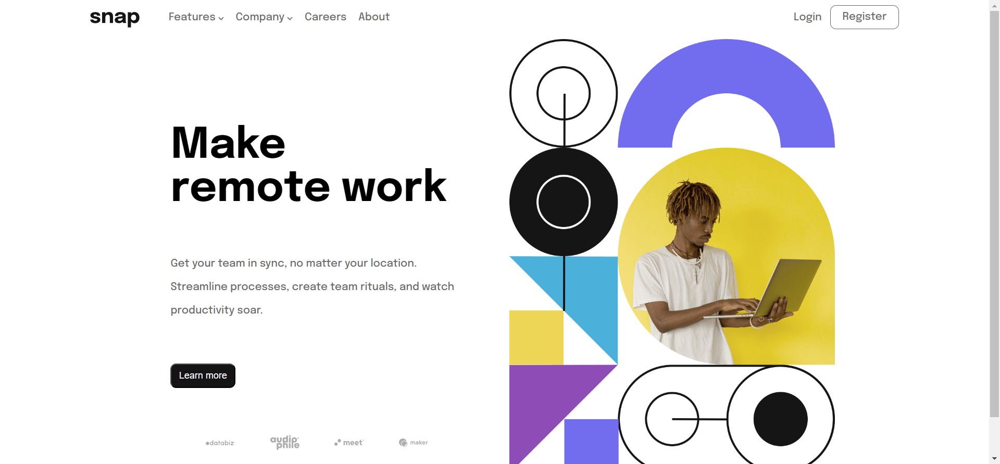

# Frontend Mentor - Intro section with dropdown navigation solution

This is a solution to the [Intro section with dropdown navigation challenge on Frontend Mentor](https://www.frontendmentor.io/challenges/intro-section-with-dropdown-navigation-ryaPetHE5). Frontend Mentor challenges help you improve your coding skills by building realistic projects. 

## Table of contents

- [Overview](#overview)
  - [The challenge](#the-challenge)
  - [Screenshot](#screenshot)
  - [Links](#links)
- [My process](#my-process)
  - [Built with](#built-with)
  - [What I learned](#what-i-learned)
  - [Continued development](#continued-development)
- [Author](#author)

## Overview

### The challenge

Users should be able to:

- View the relevant dropdown menus on desktop and mobile when interacting with the navigation links
- View the optimal layout for the content depending on their device's screen size
- See hover states for all interactive elements on the page

### Screenshot

### Links

- Solution URL: [https://www.frontendmentor.io/solutions/intro-section-with-dropdown-using-html-css-scss-vanilla-js--y5YIsyI3W](https://www.frontendmentor.io/solutions/intro-section-with-dropdown-using-html-css-scss-vanilla-js--y5YIsyI3W)
- Live Site URL: [https://intro-dropdown-orcin.vercel.app/](https://intro-dropdown-orcin.vercel.app/)

## My process

### Built with

- Semantic HTML5 markup
- CSS custom properties
- SCSS
- Flexbox
- CSS Grid
- Mobile-first workflow

### What I learned

I learned a more optimal way to create responsive navbars. I prioritized mobiile-first.

### Continued development

Implementing the onclick states would be much easier with React. I need to continue refining my RWD process.

## Author

- LinkedIn - [Adrian Guerra](inkedin.com/in/adrian-guerra-a210a4196/)
- Frontend Mentor - [@adie9](https://www.frontendmentor.io/profile/adie9)

